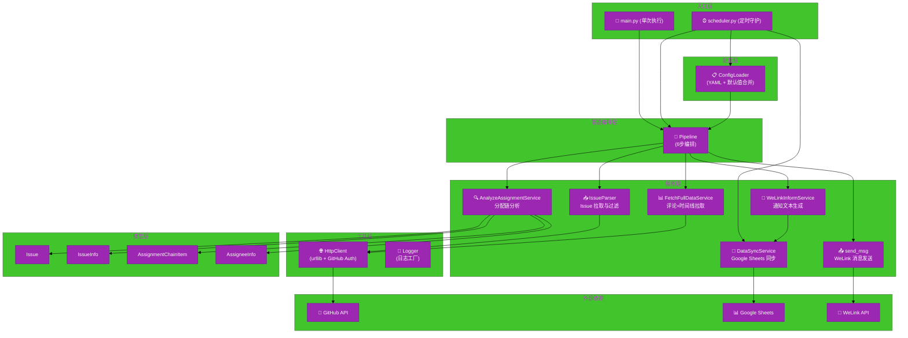
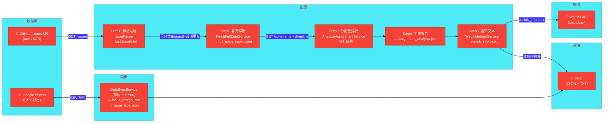

# #1 WeLink Reporter 架构设计说明书 (Architecture Design Document)

---

## 1. 基础信息

- **需求链接**: https://github.com/yyl-support/welink_reporter
- **需求名称**: WeLink Reporter —— GitHub Issue 分配链分析及 WeLink 通知推送
- **开发责任人**: yyl-support
- **设计目标**: 基于 Python 实现一个定时调度工具，通过 GitHub API 拉取 Issues 数据，解析评论/时间线中的分配事件，结合 Google Sheets 人员映射表，生成 Issue 分配链分析报告并以 WeLink 消息形式推送通知。

---

## 2. 功能设计

> **说明**：描述系统的组件构成、职责划分及交互逻辑。

### 2.1 架构图

**设计说明/归档：** WeLink Reporter 采用管道（Pipeline）架构模式，将数据处理流程分解为 6 个独立步骤，每个步骤由专门的服务组件执行。系统包含三大外部依赖：GitHub API（Issue 数据源）、Google Sheets（人员/标签映射表）、WeLink API（消息推送）。

### 2.2 数据流图

**设计说明/归档：** 数据从 GitHub Issues API 原始数据开始，经过拉取、过滤、补充、分析、格式化、推送六个阶段，同时 Google Sheets 映射数据通过每周同步维持本地缓存。

### 2.3 组件职责与接口

**设计说明/归档：** 系统采用面向接口风格的模块划分，核心组件及其职责如下。

| 组件 | 文件路径 | 职责 | 主要接口 |
|------|---------|------|---------|
| **ConfigLoader** | `src/config/loader.py` | 加载 config.yaml，合并默认值，提供类型化配置访问 | `load(path)` → Dict; `get_issues_url(config)` → str; `get_pipeline_schedule(config)` → List[str] |
| **Pipeline** | `src/pipeline.py` | 协调管道执行，组装 6 个步骤，处理早停逻辑 | `run()` → None |
| **IssueParser** | `src/services/parser.py` | 从 GitHub API 拉取 Issues，按 triaged + 近期更新过滤 | `parse()` → List[IssueInfo] |
| **FetchFullDataService** | `src/services/fetch_full_data.py` | 逐 Issue 拉取 comments 和 timeline 事件 | `fetch_full_data()` → Dict (保存至 JSON) |
| **AnalyzeAssignmentService** | `src/services/analyze_assignment.py` | 分析分配链：正式分配 + @提及 → 最终负责人判定 | `generate_analysis_report(full_report, special_labels, label_mapping)` → List[Dict] |
| **WeLinkInformService** | `src/services/welink_inform.py` | 四级优先级匹配负责人，生成通知文本 | `generate()` → 保存 welink_inform.txt |
| **DataSyncService** | `src/services/data_sync_service.py` | 从 Google Sheets 同步映射表到本地 JSON | `sync()` → {assign_count, label_count} |
| **GoogleSheetsReader** | `src/services/excel_reader.py` | 通过 CSV 导出读取 Google Sheets 人员与标签映射 | `build_all_mappings()` → ({github_id: {name, employee_id}}, {label: name}) |
| **OverdueChecker** | `src/services/checker.py` | 检查 Issue 是否逾期/已处理 | `is_overdue(issue)` → bool; `find_overdue_issues(issues)` → List[Issue] |
| **send_msg** | `src/services/send_msg.py` | 调用小录班 HTTP API 发送 WeLink 消息 | `send_msg(content, receiver, auth)` → None |
| **HttpClient** | `src/utils/http.py` | 封装的 HTTP GET 客户端，支持 GitHub Token 认证和重试 | `get(url)` → Dict/List; `get_with_delay(url)` → Dict/List |
| **Logger** | `src/utils/logger.py` | 按日期分文件的日志工厂，提供步骤和摘要格式化 | `get_logger(name)` → Logger; `log_step(logger, name, msg)`; `log_summary(logger, title, items)` |

**数据模型：**

| 模型 | 字段 | 用途 |
|------|------|------|
| `Issue` | number, state, labels, triaged_at, assignee | 逾期检查基础模型 |
| `IssueInfo` | number, title, html_url, events_url, created_at, updated_at, state, labels | GitHub API 解析结果 |
| `AssignmentChainItem` | from_user, to_user, method, time, comment | 单条分配记录 |
| `AssigneeInfo` | issue_number, issue_title, issue_url, state, labels, assignment_chain, assignee_chain, final_assignee, has_special_label, special_label_assignee, has_formal_assignment, flow_diagram | 完整分配分析结果 |

### 2.4 UX设计

> 不涉及。WeLink Reporter 为后台定时任务工具，无前端 UI 界面，交互仅通过命令行执行。

### 2.5 SOD设计

> 不涉及。本工具为单用户后台分析工具，不涉及多角色权限管控需求。

### 2.6 功能设计分解TASK清单

**设计说明/归档：** 以下为从需求到实现的开发任务分解。

| 任务 ID | 可服务性任务描述 | 责任人 |
| ------- | ---------------- | ------ |
| **TASK1** | GitHub API 数据拉取模块：实现 Issue 列表拉取、评论/时间线拉取及 triaged 过滤逻辑 | yyl-support |
| **TASK2** | Google Sheets 解析模块：实现 CSV 导出 URL 构建、PersonInfo 解析、人员映射和标签映射 | yyl-support |
| **TASK3** | 分配链分析引擎：实现正式分配、@提及、标签映射的四级优先级匹配逻辑，生成 flow_diagram | yyl-support |
| **TASK4** | WeLink 通知生成与发送：实现通知文本格式化（按负责人聚合）、调用小录班 HTTP API 发送 | yyl-support |
| **TASK5** | 定时调度框架：基于 schedule 库实现每日多时段执行和每周数据同步 | yyl-support |
| **TASK6** | 配置管理系统：实现 YAML 加载、默认值合并、配置键访问接口 | yyl-support |
| **TASK7** | 日志与测试体系：按日期日志输出、覆盖核心模块的单元测试与集成测试 | yyl-support |

---

## 3. 非功能设计

### 3.1 安全与隐私设计评估和设计

> **注意**：本项目不涉及 `need_security` 标签，不适用详细威胁建模。以下为基线安全评估。

#### 3.1.1 威胁分析 (Threat Modeling)

**设计说明/归档：** 本工具为内部后台任务，不暴露网络接口，不存储用户数据。主要风险点在于凭证管理和外部 API 调用。

**威胁分析表：**

| 威胁类别 | 攻击场景描述 (Scenario) | 风险等级/评分 | 对应减缓措施 (Mitigation) |
| --- | --- | --- | --- |
| **信息泄露** | 日志中误输出 GitHub Token 或 WeLink Auth 密钥 | 中 | 日志输出仅记录配置键名，禁止输出 Token 值；代码审查确认无敏感值日志打印 |
| **凭证泄露** | config.yaml 或环境变量中硬编码凭证泄露到代码仓库 | 高 | GitHub Token 通过环境变量 `GITHUB_TOKEN` 注入；config.yaml 中 WeLink auth 字段留空；.gitignore 排除含凭证的配置文件 |
| **中间人攻击** | HTTP 调用 Google Sheets/WeLink API 被中间人截获 | 低 | Google Sheets 使用 HTTPS URL；WeLink API 调用走内网环境 (`xiaoluban.rnd.huawei.com`)，外部不可达 |
| **拒绝服务** | 高频调用 GitHub API 触发速率限制 | 低 | HttpClient 内置 `get_with_delay()` 方法控制请求间隔；每日定时执行，非持续调用 |

#### 3.1.2 安全设计实现 (Security Mechanisms)

**设计说明/归档：**

- **凭证管理**：GitHub Token 通过环境变量 `GITHUB_TOKEN` 注入，不入库、不硬编码。WeLink 认证字符串通过 config.yaml 配置（仓库中保持空值）。
- **传输安全**：GitHub API 使用 HTTPS（`https://api.github.com`）；Google Sheets CSV 导出使用 HTTPS；WeLink API 走内部域名（`xiaoluban.rnd.huawei.com`）。
- **日志审计**：Logger 按日期（`log/YYYY-MM-DD.log`）输出，包含时间戳、日志级别、模块名，满足基本追溯需求。关键步骤通过 `log_step()` 和 `log_summary()` 输出结构化信息。
- **输入验证**：Issue Label 过滤通过精确字符串匹配；URL 构建使用字符串模板，不涉及 SQL 注入风险。
- **软件供应链**：依赖通过 `requirements.txt` 明确版本约束（PyYAML>=6.0, schedule>=1.2.0, requests>=2.32, pytest>=8.0），无本地二进制包引入。

#### 3.1.3 安全任务分解 (Security Task Breakdown)

| 任务 ID | 安全任务描述 (Security Tasks) | 责任人 |
| ------- | ----------------------------- | ------ |
| **TASK8** | 确认 .gitignore 排除所有含凭证的本地配置文件 | yyl-support |
| **TASK9** | 代码审查：确认日志输出中无 Token/密码等敏感字段打印 | yyl-support |
| **TASK10** | 在 README 中补充 GITHUB_TOKEN 环境变量配置说明 | yyl-support |

### 3.2 可靠性与韧性设计评估和设计（可选）

**设计说明/归档：** 本项目为非 Core/Critical 级服务，不适用严格 SLA 要求。以下为基础韧性措施：

- **错误容忍**：`HttpClient.get()` 对所有异常（HTTPError、URLError、JSONDecodeError、Exception）返回空列表 `[]`，保证管道不会因网络抖动而崩溃。
- **重试机制**：`HttpClient` 内置 `retry_delay` 参数控制请求间隔，防止 GitHub API 速率限制。
- **管道早停**：Pipeline.run() 在 Step1 无 triaged Issue 时提前返回，避免无效的后续 API 调用。
- **线程隔离**：scheduler.py 中每个定时任务在独立 daemon 线程中执行，单任务异常不影响调度器主循环。

### 3.3 可服务性与可观测性评估和设计（可选）

**设计说明/归档：**

- **日志系统**：按日期自动创建 `log/YYYY-MM-DD.log` 文件，Logger 工厂防止重复 Handler。关键管道步骤通过 `log_step()` 输出带边框的步骤标题，通过 `log_summary()` 输出结构化摘要。
- **运行模式**：支持两种运行模式——`main.py` 单次执行（调试/手动触发）、`scheduler.py` 守护进程（生产环境定时调度）。
- **数据归档**：所有中间产物（`full_issue_report.json`、`assignment_analysis.json`、`welink_inform.txt`）均持久化在 `data/` 目录，便于问题排查和历史回溯。
- **测试覆盖**：52 个测试用例覆盖配置加载、人员解析、分配链匹配、逾期检查、通知生成、数据同步、调度配置等核心模块，可通过 `python -m pytest tests/ -v` 一键运行。

### 3.4 性能与伸缩性评估和设计（可选）

**设计说明/归档：**

- **单线程顺序执行**：Pipeline 六个步骤串行执行，适用于当前 Issue 量级（每仓库 < 100 个活跃 Issue）。若未来数据量增长，可将 Step2（每个 Issue 独立拉取 comments/timeline）改为并发执行。
- **无状态设计**：管道本身不维护跨次执行的状态，每次 run() 均为全新的数据拉取和分析流程。
- **资源占用**：纯 Python 进程，无数据库依赖，运行时内存消耗低（约 50-100MB），适合低成本 VPS 或容器部署。
- **水平扩展**：不建议多实例并行（会导致重复通知）。如需扩展，可在独立机器上运行不同仓库的监控实例。

---
