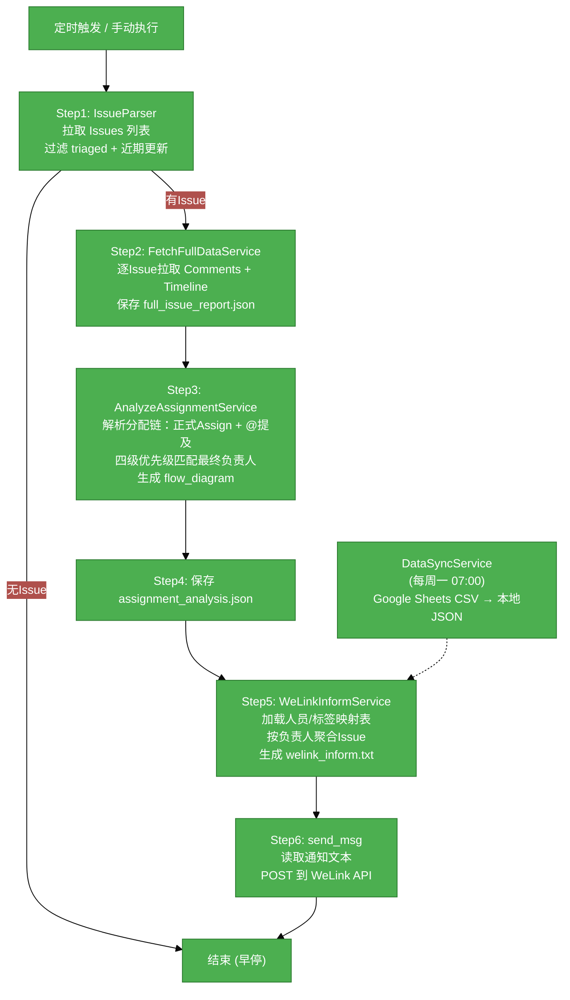

# #1 WeLink Reporter 需求分析说明书

## 1. 基础信息

- **需求链接**: https://github.com/yyl-support/welink_reporter
- **需求名称**: WeLink Reporter —— GitHub Issue 分配链自动分析及 WeLink 通知推送
- **开发责任人**: yyl-support

---

## 2. 需求场景说明

> 描述"在什么情况下，为了解决什么问题，用户需要做什么"。

**场景说明:**

在开源社区日常维护中，仓库管理员面临以下痛点：

1. **Issue 分配跟踪困难**：GitHub Issues 的分配行为分布在评论 @提及和正式 Assignee 操作中，缺乏统一视图追踪一条 Issue 从创建到最终负责人的完整流转链。
2. **通知效率低**：管理员需要手动浏览 Issues 列表，逐一确认各 Issue 的当前负责人，再通过 IM 工具逐个通知，重复性工作耗时且易遗漏。
3. **人员映射不透明**：GitHub 账号（如 `zhangsan`）与内部通讯录（如 `张三 工号12345`）缺乏自动映射机制，通知时需要人工查表转换。
4. **特殊标签追溯**：部分 Issue 带有特殊标签（如 `gqa-model`、`310P`），需要定向通知特定人员，现有流程依赖人工记忆。

WeLink Reporter 通过自动化管道解决以上问题：每日定时从 GitHub API 拉取 Issues 数据，解析分配链并匹配内部人员映射表，生成格式化的 WeLink 通知消息，自动推送到指定群组。

---

## 3 需求验收标准

> 明确需求完成的标志，必须是可量化、可测试的。

**验收标准:**

- 系统每日至少 2 次（默认 08:00、14:00、19:00）自动执行全管道流程，无需人工触发。
- 正确识别 Issue 的完整分配链（正式 Assign + 评论 @提及），生成可追溯的 `assignment_analysis.json` 报告。
- 通知消息按负责人聚合，每个负责人一行包含其所有待处理 Issue 链接，格式为 `请@张三，看下(issue_url1)(issue_url2)`。
- 支持四级优先级分配匹配：特殊标签责任人 > 时间线正式分配人 > 标签映射人 > 全员提醒。
- Google Sheets 人员映射表每周自动同步，支持带工号的完整映射格式（`人名工号(github-id)`）。
- 通过 GitHub Issues API 过滤机制（triaged 标签 + 近期更新），确保只分析和通知有效未关闭的 Issues。
- 所有中间产物持久化到 `data/` 目录，日志按日期归档至 `log/` 目录，便于排查和审计。

---

## 4. 需求设计与分解

> 说明：基于初步方案，将需求拆解为可实施的原子 Task。

### 4.1 核心逻辑方案

> 简述实现逻辑（如：数据流向、模块改动、新增配置项等），作为任务拆解的理论依据。

**逻辑方案:**

采用管道（Pipeline）架构，将全流程拆分为 6 个顺序执行的独立步骤，每个步骤由专门的服务组件负责。系统通过 `schedule` 库实现定时调度，支持每日多时段执行 + 每周数据同步。外部依赖通过 API 调用集成，内部数据通过 JSON 文件进行组件间传递。

**关键设计点：**

- **Issue 过滤**：仅拉取含 `triaged` 标签且近期（7天）有更新的 Issues，减少无效 API 调用。
- **分配链分析**：合并 GitHub Timeline 事件（assigned/menioned/labeled/commented）和 Issue Comments 中的 @提及，按时间排序构建完整分配链 `assignment_chain`，优先取最新正式分配作为 `final_assignee`。
- **四级匹配优先级**：特殊标签（`gqa-model`、`310P`）> Timeline 正式 Assignee 链 > Issue 标签到人映射 > `@所有人` 兜底。
- **人员映射**：支持 `人名工号(github-id)` 和 `人名(github-id)` 两种 Google Sheets 格式，自动提取姓名、工号、GitHub ID 三要素。
- **配置驱动**：所有行为参数（仓库名、过滤标签、调度时间、特殊标签列表等）均通过 `config.yaml` 控制，支持默认值合并。

### 4.2 任务清单

**任务清单:**

| 任务 ID | 任务描述 (Task Description) | 预期产出 (Deliverables) | 预期工作量（人天） |
| ------- | --------------------------- | ----------------------- | ------------------ |
| **task1** | GitHub API 数据拉取模块：实现 Issue 列表/评论/时间线的拉取、JSON 解析、triaged 过滤、错误容错 | `src/services/parser.py`、`src/services/fetch_full_data.py`、`src/utils/http.py` | 3 |
| **task2** | Google Sheets 解析模块：实现 CSV 导出 URL 构建、PersonInfo 多格式解析、人员映射和标签映射生成 | `src/services/excel_reader.py`、`src/services/data_sync_service.py` | 2 |
| **task3** | 分配链分析引擎：实现正式分配 + @提及合并、四级优先级匹配、flow_diagram 生成 | `src/services/analyze_assignment.py`、`src/models/issue.py` | 3 |
| **task4** | WeLink 通知生成与发送：实现按负责人聚合的通知文本格式化、小录班 HTTP API 调用 | `src/services/welink_inform.py`、`src/services/send_msg.py` | 2 |
| **task5** | 管道编排与调度：实现 6 步 Pipeline 编排、定时调度守护进程、早停逻辑 | `src/pipeline.py`、`scheduler.py`、`main.py` | 2 |
| **task6** | 配置管理：实现 YAML 加载、默认值合并、类型化配置访问接口 | `src/config/loader.py`、`config.yaml` | 1 |
| **task7** | 日志与测试：实现按日期日志输出、52 个单元测试与集成测试用例 | `src/utils/logger.py`、`tests/` | 2 |

---

## 5. 需求相关性分析

> **操作说明**：根据上述拆解出的 Task，识别其变更行为。任何一项勾选为"是"，打上对应 issue 标签，必须执行对应的流程门禁。

### A. 安全相关性分析

> 若涉及以下任一项，打标 `need_security`标签，PR 必须关联特性 issue 的架构设计文档（含安全设计部分）。

- [ ] **边界变更**：新增公网端口、修改防火墙规则、变更网关配置。
- [x] **凭证处理**：涉及密钥（Secret/Key）、Token、证书的存储或分发。  
  _原因：使用 `GITHUB_TOKEN` 环境变量进行 GitHub API 认证，需确保不在代码/日志中泄露。_
- [ ] **权限调整**：修改权限模型、服务账号（SA）权限或鉴权逻辑。
- [ ] **供应链**：引入新的第三方二进制文件、SDK 或重大版本依赖升级。  
  _说明：新增 PyYAML、schedule、requests 等 Python 包依赖，均为成熟 PyPI 包，非二进制引入。_
- [ ] **隐私风险评估**：涉及用户个人数据（Email、手机号、IP、邮箱 等）的处理。  
  _说明：Google Sheets 中包含内部员工姓名和工号，属于内部数据而非对客隐私数据。_
- [ ] **AI使用**：涉及 AIGC 能力应用，并提供服务。

### B. 架构设计相关性分析

> 若涉及以下任一项，打标 `need_design`标签，PR 必须关联特性 issue 的架构设计文档。

- [ ] A环节判定需要完成安全设计
- [ ] 改变了现有系统的物理/逻辑拓扑
- [x] 新增或大幅修改对外暴露的 API/CLI 接口  
  _原因：新增 `main.py`（单次执行）和 `scheduler.py`（定时守护）两个 CLI 入口，提供完整的命令行操作接口。_
- [x] 引入了新的中间件、数据库或三方核心组件  
  _原因：引入 `schedule` 库作为定时调度引擎、GitHub API 作为核心数据源、WeLink API 作为消息推送通道。_

### C. 系统集成测试相关性分析

> 若涉及以下任一项，打标 `need_itest`标签，PR必须关联特性 issue 的测试策略和测试报告文档。

- [x] 上述环节判定需要执行安全设计或架构设计。  
  _原因：B 环节判定需要架构设计。_
- [ ] **跨组件影响**：变更会触发下游服务或关联系统的连锁反应（级联效应）。
- [ ] **核心组件管控**：含项目定级为 Core 的核心逻辑变更。
- [ ] **环境强依赖**：功能高度依赖内核参数、网络拓扑或特定的物理挂载。
- [x] **端到端流程**：涉及从用户输入到持久化存储的全链路逻辑。  
  _原因：数据从 GitHub API 拉取 → 解析过滤 → 分配链分析 → 通知生成 → WeLink 推送，覆盖完整的数据生命周期（Source → Process → Store → Output）。_

### D. 用户体验相关性分析

> 若涉及以下任一项，打标 `need_ux`标签，PR必须关联特性 issue 的用户体验设计文档。

- [ ] **交互逻辑变更**：涉及 Web 门户、控制台（Dashboard）或命令行工具（CLI）的交互流程调整。  
  _说明：CLI 入口为后台守护进程，无交互式操作。_
- [ ] **感知性能变动**：变更可能显著影响页面的加载时间、同步请求的响应时延或异步任务的进度反馈。
- [ ] **文档与辅助能力**：涉及报错提示语、帮助中心链接、FAQ 或新功能的 Runbook 说明。  
  _说明：README.md 提供完整的配置和运行说明。_
- [ ] **无障碍与多语种**：涉及国际化（i18n）支持、辅助功能或不同终端（移动端/桌面端）的适配。

### 5.1 需求相关性分析汇总结果

- [x] **need_security** — 涉及 GitHub Token 凭证处理（A-凭证处理），需在架构设计中包含安全设计章节。
- [x] **need_design** — 新增 CLI 接口、引入 schedule/GitHub API/WeLink API 三方核心组件（B-接口 + B-三方组件），需提供架构设计文档。
- [x] **need_itest** — 涉及架构设计（B 环节）且覆盖端到端全链路流程（C-端到端），需提供测试策略和测试报告。
- [ ] need_ux (不涉及前端交互)
- [ ] need_light (已勾选上述安全/设计/集成测试标签)

---

## 6. 价值识别与业务评估

> **判定准则**：基础设施接纳需求必须具备明确的 ROI（投资回报比）或合规必要性。

| 维度 | 评估问题 | 结论/说明 |
| ---- | -------- | --------- |
| **范围判定** | 该需求是否属于基础设施范围内？ | **是** —— 属于开源社区运营基础设施，提升 Issue 管理自动化水平 |
| **规划一致性** | 该需求是否在年度技术规划中？ | **否** —— 为社区运营的增量工具需求 |
| **优先级** | 该需求优先级评估（高/中/低）？ | **中** —— 解决日常重复性工作，但不阻塞核心业务流程 |
| **通用性** | 该需求是否解决 3 个以上业务方的共性痛点？ | **否** —— 当前针对 vllm-ascend 仓库，但设计可复用于其他 GitHub 仓库 |
| **必要性** | 现有组件通过配置变更是否无法实现目标或没有不开发的替代方案？ | **是** —— GitHub 原生 Notifications 不支持分配链追溯和按人聚合推送，无现有工具替代 |
| **工作量** | 预计总工作量 xx 人天？ | **15 人天**（7 个任务） |
| **价值评估** | 实现后能减少多少手动操作或提升多少系统稳定性？ | 每次 Issue 管理周期可节省约 20 分钟手动盘点 + 通知时间，每日 3 次自动推送覆盖全天时段，预计减少管理员 80% 的 Issue 跟踪和通知相关重复性工作 |

> **状态定义：** **Accept (准入)** | **Reject (驳回)** | **Pending (待议)**

**建议结论**： **Accept**

**原因描述:** 该需求通过自动化 Issue 分配链分析和 WeLink 通知推送，预计每日可为仓库管理员减少约 1 小时的重复性手动核对和通知工作。系统实现了从数据拉取、分配链分析、人员映射到消息推送的全自动化闭环，且架构设计具备良好的模块化解耦，可低成本复用到其他 GitHub 仓库。符合"以自动化替代重复劳动"的基础设施建设目标。

---
